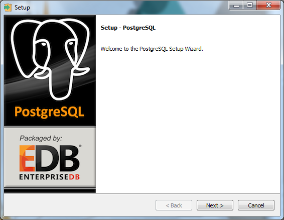
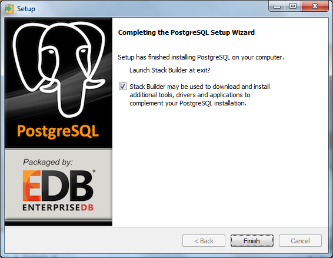
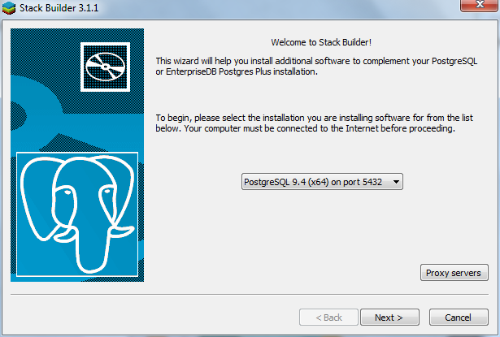
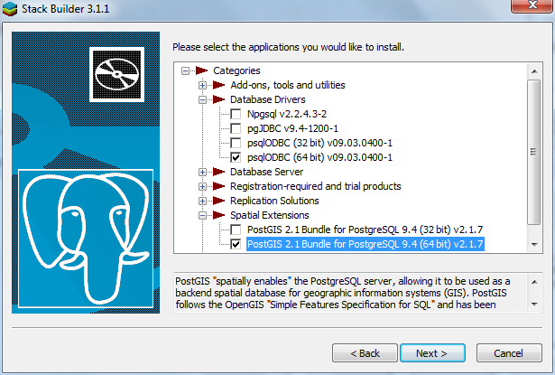
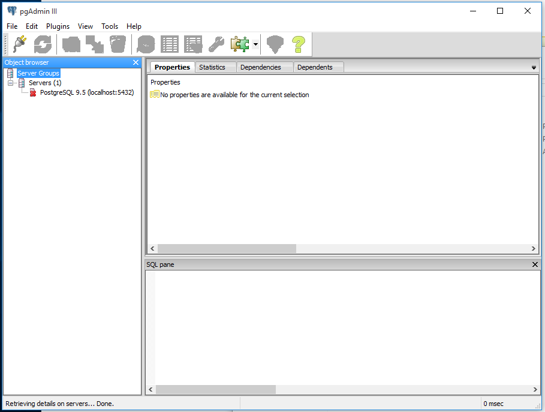
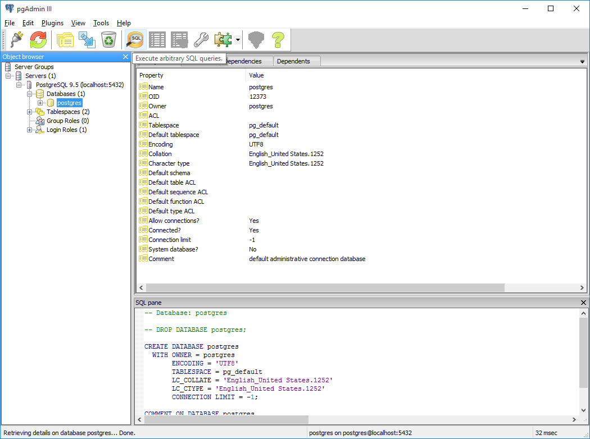
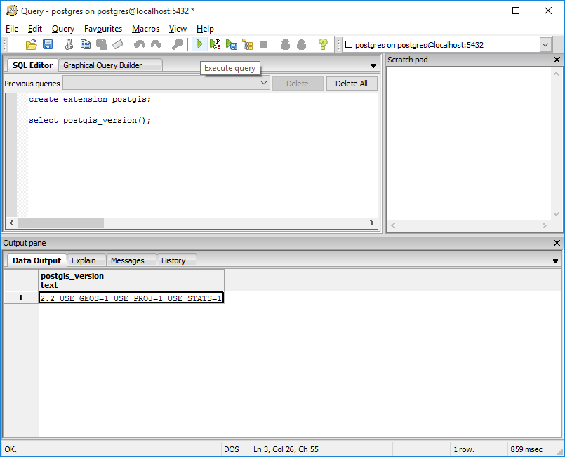

% Installation Instructions for Movement Data workshop

This page gives instructions to install the latest versions of the
necessary software for the workshop:

* PostgreSQL v9.5
* PostGIS v2.2
* GDAL v2.1
* QGIS 2.1
* R v3.3
* RStudio v0.99


## PostgreSQL/PostGIS

***If you already have PostgreSQL installed***: if you installed using
the EnterpriseDB process below, use the Application Stack Builder to
check/update your PostgreSQL/PostGIS versions to 9.5+ and 2.2+,
respectively. If your PostgreSQL version is up-to-date but you need to
update pgAdmin3, find the newest version
[here](http://www.pgadmin.org/download/index.php).


### Windows/OS X Users

Start your installation by downloading the latest stable (non-beta)
version (currently 9.5.x) for your system
from [EnterpriseDB](http://www.enterprisedb.com/products-services-training/pgdownload),
and follow the instructions. Note that the version in the screenshots
below is 9.4, your version will likely be newer (9.5 or above). Run
through the installation wizard for PostgreSQL.



You can accept all defaults during the installation, but **make sure
to remember the password** you assign to the superuser (postgres)! You
will need this to login to the database server. Once PostreSQL is
installed, you also have to install PostGIS and psqlODBC drivers, as
shown in the screenshots below.




*Note*: Your PostGIS version will be newer (likely 2.2) than shown in
the image below.



Run through the installations psqlODBC and PostGIS, allowing PostGIS
to set the environmental variables and out-of-db rasters. Once
finished with the installs, skip to the section below on
[verifying your install](#post4).


### Linux


#### Option 1

Start your installation by downloading the latest stable (non-beta)
version (currently 9.5.x) for your system from
[EnterpriseDB](http://www.enterprisedb.com/products-services-training/pgdownload),
and follow the instructions.

To start the installer, open a terminal and log into root: `su root`.

Then simply run the downloaded file, and follow the instructions in
the terminal.

See below for user setup instructions.


#### Option 2 (tested on Ubuntu/Debian)

*Note*: using this option, postgresql/postgis versions may vary
depending on your Linux distribution and version.

Update the package manager and install postgresql:

```
sudo apt-get update
sudo apt-get install postgresql-9.5 postgresql-client-9.5
```

Then install Postgis and pgAdmin3:

```
sudo apt-get install postgis pgadmin3
```


#### Linux user instructions

The postgresql installation creates a new user, postgres. If you want
to log in using your system user credentials, you can create a
database user/role with the same name (and password) using the
[createuser](http://www.postgresql.org/docs/9.1/static/app-createuser.html)
command in the terminal.

First, switch to the root, and then postgres user:

```
su root
su postgres
```

Then create the new user and follow the instructions. If you are the
primary database user it is recommended to match the username/password
to your Linux username/password, make them a superuser, and allow them
to create databases and roles. Then you can log in to the database
with the same credentials you use for Linux.

```
createuser --interactive -P
Enter name of role to add: user1
Shall the new role be a superuser? (y/n) y
Shall the new role be allowed to create databases? (y/n) y
Shall the new role be allowed to create more new roles? (y/n) y
```


### Verify your PostgreSQL/PostGIS installation

Once finished with the install, open up the program pgAdmin3:



Right click on the the server `PostgreSQL 9.5 (localhost:5432)`, and
click Connect. Now you will log in as the `postgres` user, using the
password you assigned in the install process.

Once you are connected, expand 'Databases' and click on the `postgres`
database (this is a default database created with the installation
process). With it highlighted, open up an SQL window by clicking on
the SQL button.



Now type the commands as shown below in the SQL window, and then click
the 'Execute query' button. If you see a result (in the Output pane of
the SQL window) similar to that shown in the example below, you have
successfully installed PostGIS! If you receive any errors, go back to
the Stack Builder (as described above) and check your installed
software, and if necessary install/update PostGIS.




## QGIS + GDAL


### Windows

Windows users can install both QGIS and GDAL with the OSGeo4w
installer. Download the network installer
[here](https://trac.osgeo.org/osgeo4w/), and run it, selecting the
*Express Desktop Install*, then install QGIS and GDAL (you can
un-select the other options).


### OS X

You can download and run the "Current" version QGIS installer from
[here](http://www.kyngchaos.com/software/qgis). This .dmg file
includes a set of four packages (inlcluding GDAL complete) which need
to be installed, the last of which is QGIS.


### Linux (Ubuntu/Debian)

GDAL and other necessary packages can be installed from the repository
using the package manager:

```
sudo apt-get install gdal-bin
sudo apt-get install libproj-dev
sudo apt-get install libgdal-dev
```

To install QGIS, it is recommended to follow the instructions
[here](https://www.qgis.org/en/site/forusers/alldownloads.html#linux)
specific to your distribution.


## R / RStudio

***If you already have R installed***: it is recommended to update
your R version for this workshop, so that everyone is using a newer
version (3.3.0 or above at this time) for the workshop. To check the
version you are using, run the command `R.Version()$version.string` in
R. On Windows and OS X, the preferred method to update R is to
uninstall R first, using the typical uninstall method for your system
(e.g, in Windows, go to Control Panel -> Programs and Features). Your
installed packages should not be deleted during the install, and you
can transfer them to the new version using the method described
further below.


### Install R

Installers for all systems can be found at
[here](https://cran.rstudio.com/), which will guide you through the
install process.

Once the new version is installed, open it and try to install a
package (e.g., run `install.packages('raster')`). R will ask you to
create a new folder to store user packages, if you don't have
permissions on the default package library. Note the location of the
new folder R creates, install the package, and then close R. If this
is a new install of R, you can skip to the RStudio section.


#### For those updating R: copying packages from the old version

If you had a user library for your packages from the previous version
and want to use them in the new version, locate the folder containing
these packages (e.g., in Windows, it is generally found at
`C:\Users\YOUR_USERNAME\Documents\R\win-library\x.x`, where the new
one should also be). Copy the packages from the this folder to the new
version's folder. Then open R, and run
`update.packages(checkBuilt=TRUE, ask=FALSE)` to update these packages
to their newest versions. If R is not finding your new user library,
you can also check/set all the folders R looks for packages in by
running `.libPaths()`).


### Install/update RStudio

Installers for Windows, OS X, and several Linux distributions are
available
[here](https://www.rstudio.com/products/rstudio/download/). Even if
you already have RStudio installed, it is recommended to download the
newest version, which will work best with the newest R version. There
is no need to uninstall the previous version first.


### Install R packages for the workshop

To start with, the `devtools` package will be necessary to install
packages developed in the lab. Install it first by opening R, and then
typing in the command line:

```r
install.packages("devtools")
```


#### Connection between PostGIS and R

To connect PostGIS and R, four packages are useful:

* `RPostgreSQL`: provides a standard connection from R to PostgreSQL;
* `rgdal`: access to the GDAL library from R;
* `rgeos`: access to the GEOS library from R;
* `rpostgis`: various functions to interact between R and PostGIS.

To install them, open R, and type in the command line:

```r
install.packages(c("RPostgreSQL", "rgdal", "rgeos"))
library(devtools)
install_github("mablab/rpostgis")
```

Run `install.packages('rgdal','rgeos')` in R to install or update the
two packages. After installation, load each library:

```r
library(rgdal)
library(rgeos)
```

Note the messages after loading each package. If GDAL and GEOS (two
system packages for handling GIS data which were installed in the
steps above) are installed correctly, after loading `rgdal`, you
should see something like:

```
rgdal: version: 1.1-7, (SVN revision 612)
 Geospatial Data Abstraction Library extensions to R successfully loaded
 Loaded GDAL runtime: GDAL 2.0.1, released 2015/09/15
```

And something like this after loading `rgeos`:

```
rgeos version: 0.3-19, (SVN revision 524)
 GEOS runtime version: 3.5.0-CAPI-1.9.0 r4084 
 Linking to sp version: 1.2-3 
 Polygon checking: TRUE
```

If the GDAL or GEOS packages are missing, they will need to be
installed for the R packages to work correctly. For troubleshooting OS
X issues, see the instructions
[here](http://tlocoh.r-forge.r-project.org/mac_rgeos_rgdal.html).


#### Movement ecology in R

For the analysis of animal tracking data, we often use functions from
the adehabitat family which consists of four packages:

* `adehabitatMA`: management of raster maps;
* `adehabitatLT`: analysis of trajectories;
* `adehabitatHR`: home range estimation;
* `adehabitatHS`: habitat selection analysis;
* `hab`: habitat selection and movement analyses.

Other packages are also necessary for the workshop:

* `sp`: spatial data in R;
* `raster`: special package for raster data;
* `lubridate`: management of dates/timestamps in R.

Let's install all necessary packages right now:

```r
install.packages(c("adehabitatHS", "raster", "lubridate"))
library("devtools")
install_github("basille/hab")
```

Loading the packages `hab`, `raster` and `lubridate` should show no
error:

```r
library("hab")
library("raster")
library("lubridate")
```
